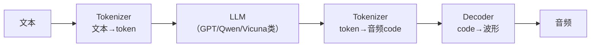

## LLM 开始"接管"语音合成了

2024 年，TTS 领域发生了一件大事——大语言模型（LLM）开始直接生成语音。

传统 TTS 是"专用模型做专用事"：Tacotron 做声学模型，HiFi-GAN 做声码器，各模块独立训练。但 LLM 的出现打破了这一范式。VALL-E X、VoiceCraft、Moshi、GPT-4o Voice……这些模型用同一个 LLM backbone 同时处理文本理解、语音生成、甚至语音编辑。

这不是简单的架构替换，而是范式迁移——TTS 从"独立任务"变成了"LLM 多模态能力的一部分"。

## LLM-based TTS 的核心架构

LLM 不能直接处理连续音频，所以关键一步是**语音 tokenization**——把音频离散化成 token 序列：



语音 tokenizer 是这个架构的"翻译官"。目前主流方案有三个：

| Tokenizer | 类型 | 码率 | 特点 |
|-----------|------|------|------|
| **EnCodec** (Meta) | 神经声码器 VQ | 6-12 kbps | 压缩率高，音质好 |
| **SpeechTokenizer** | 多尺度 VQ | 2-4 kbps | 同时编码语义和声学信息 |
| **DAC** (Descript) | 改进 VQ | 1-2 kbps | 极低码率下音质仍好 |

有了语音 tokenizer，LLM 就能像处理文本一样处理语音。训练时，模型同时学习文本和语音 token；推理时，LLM 直接输出语音 token，再由 decoder 还原为波形。

## 为什么 LLM-based TTS 是趋势？

**零样本能力天然好**。LLM 的泛化能力让音色克隆和风格迁移更稳定——只需几秒参考音频，就能克隆出目标音色，无需专门训练。

**统一架构**。同一套模型可以同时做 TTS、语音编辑、语音翻译、甚至全双工对话。Moshi 就是这样——它不是"ASR→LLM→TTS"的 pipeline，而是端到端的语音对话模型。

**可缩放**。LLM 遵循 scaling law：数据越多、参数越大、效果越好。这意味着 LLM-based TTS 还有巨大的提升空间。

**指令对齐**。你可以用 system prompt 控制风格、情感、语速——"用疲惫、略带无奈的语气说这句话"，LLM 能理解并执行。

## 流式合成：从"发语音条"到"打电话"

传统 TTS 是整句合成——用户说完一整句，等 1-3 秒，听到整句回复。这像"发语音条"。

流式合成 TTS 是边生成边播放——首包延迟 200-500ms，第一个字出来时，后面的内容还在合成中。这像"打电话"。

| 模式 | 首包延迟 | 用户体验 |
|------|---------|---------|
| 整句合成 | 1-3 秒 | 像"发语音条" |
| 流式合成 | 200-500ms | 像"打电话" |

流式合成有三种技术方案：

**Chunk-Based**：按标点或语义切 chunk，每个 chunk 整句合成。实现简单，质量高，但 chunk 边界有断裂感。

**流式自回归（Streaming AR）**：逐 token 生成，边生成边输出。韵律好，但速度慢。关键技术包括 Chunk-wise AR、Look-ahead window、Streaming Attention。

**流式非自回归（Streaming NAR）**：Block-wise 并行生成，速度快，但韵律相对平淡。

## 全双工对话：语音交互的终极形态

如果说流式合成是"边说边放"，那全双工对话就是"边说边听、随时打断"。

```
用户：开始说话...
AI：实时 ASR 识别中...
用户：继续说话...
AI：预测用户何时说完，准备回应
AI：开始回应（流式 TTS）
用户：打断！"不对，我的意思是..."
AI：立即停止 TTS，重新识别
AI：重新回应
```

这需要解决四个核心技术挑战：

- **Turn Detection**：预测用户何时说完
- **Endpointing**：检测语音结束点
- **Barge-in**：用户打断时 AI 立即停止
- **Simultaneous Processing**：ASR 和 TTS 同时进行

Moshi（Kyutai）是首个开源的全双工语音对话模型，GPT-4o Voice Mode 则把这一能力带入了消费级产品。

## 回头看：TTS 正在被重新定义

从专用模型到统一架构，从整句合成到流式合成，从半双工到全双工——TTS 正在经历前所未有的范式迁移。

LLM 不仅带来了音质提升，更重要的是带来了**统一性**：同一个模型可以处理文本、语音、对话，甚至视觉。TTS 不再是独立任务，而是多模态大模型的一个能力维度。

未来 2-3 年，随着 LLM-based TTS 的推理成本降低、实时率提升，我们有望看到语音交互从"发语音条"全面升级为"打电话"，甚至"面对面交谈"。

下次当你和 AI 语音对话时，不妨留意一下——它的回应是"念稿"还是"说话"，是"等你听完"还是"随时准备接话"。这些细节背后，是一场正在发生的技术革命。
