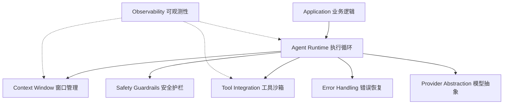

## 模型是引擎，但谁来开车？

大语言模型的能力在过去两年以令人窒息的速度增长。GPT-4o 的上下文窗口开到 128K，Claude 3.5 把 Agent 循环做到了原生支持，各家模型在 benchmark 上轮番刷榜--很容易让人觉得"模型这么强了，直接给它一个 prompt 不就够了？"

但任何一个把 Agent 从 Demo 推到生产的人都会告诉你同一个教训：**模型的智商不是瓶颈，控制才是。**

这就是 Harness Engineering（驭手工程）要解决的问题。它的定位很清楚：**不训模型，只造底盘**。模型是引擎，Harness 是底盘、转向和刹车--马力再大没有后者的车，没人敢开。

---

## 驭手工程：LLM 周围的七个模块

Harness Engineering 的本质是为 LLM 构建一套**控制面（control plane）和运行时基础设施（runtime infrastructure）**。把它想象成操作系统的内核--管理资源、调度任务、处理异常、记录日志--只不过这次，被管理的资源是**大模型的推理能力**。

整个控制面可以拆成七个模块：



| 模块 | 职责 |
|------|------|
| **Agent Runtime / Orchestration** | 执行循环（ReAct loop）、多 Agent 编排、Human-in-the-loop |
| **Tool Integration & Sandboxing** | 工具注册、安全执行沙箱、结果格式化 |
| **Context Window Management** | 窗口内容组装、对话压缩策略、记忆检索注入 |
| **Safety Guardrails** | 输入/输出审查、工具调用拦截、内容安全检测 |
| **Error Handling & Recovery** | 重试与退避、降级策略、自愈循环、checkpoint 恢复 |
| **Observability** | 全链路 Tracing、Metrics 采集、Cost Tracking |
| **Provider Abstraction** | 统一模型接口、动态路由、fallback chain |

这七个模块中，大多数已经相对成熟：编排和工具集成有 LangGraph、AutoGen 这些框架兜底；观测和 Provider 抽象也有 OpenAI SDK 和 LangSmith。**但上下文窗口管理，是七模块中最硬核、最不成熟、也最直接影响产品体验的一个。**

为什么它这么难？因为你要对抗的不是代码 bug，而是物理定律--自注意力的 O(n²) 复杂度。

---

## 上下文战场：三个不可逾越的硬约束

在开始讨论"怎么管上下文"之前，先搞清楚我们在对抗什么。上下文窗口有三个硬约束，是数学和物理决定的，不是工程能绕开的：

**约束一：窗口大小是固定的。** 即使今天有 1M token 的窗口，它也是有限的。而且更大的窗口意味着更贵的推理--模型不是"免费上下文"，你要为每一寸窗口付费。

**约束二：注意力随位置衰减。** 这不是模型设计的问题，而是自注意力机制的内在特性--中间地带的 token 天然比开头（首因效应）和结尾（近因效应）获得更少的注意力。这就是著名的 **Lost-in-the-Middle** 现象：你把关键信息放在对话中途，模型可能根本"看不见"它。

**约束三：成本是 O(n²)。** 自注意力计算的复杂度与 token 数的平方成正比。这意味着，一个 8K token 的窗口和 128K token 的窗口，不算模型能力的差异，光是物理成本就是天壤之别：

```
窗口大小      单次推理成本 (est.)      100 轮对话累积
8K            ~$0.10                   ~$10
32K           ~$0.40                   ~$40
128K          ~$1.60                   ~$160
1M            ~$12.00                  ~$1200
```

所以上下文管理不只是讨好模型--**它的核心驱动力是成本控制。** 省下来的每一寸窗口都是真金白银。

---

## 窗口组装：把窗口当成战略地图

理解了约束之后，核心问题就变成了：**有限的窗口里，应该放什么？**

答案是分层组装，让最重要信息出现在注意力最强的地方。一个典型的上下文组装结构：

```
┌──────────────────────────────┐
│  System Prompt        (5-15%)│  ← 固定不变：角色定义、安全规则、工具描述
│  Long-term Memory    (10-30%)│  ← 动态：按需从 Memory Store 检索相关记忆
│  Working Context     (10-20%)│  ← 当前任务描述和约束
│  Conversation History(30-60%)│  ← 最需要管理的部分，消耗最多窗口
│  Retrieved Knowledge  (变动大)│  ← RAG 素材，按需注入
│  Tool Results         (变动大)│  ← 当前轮的工具返回
└──────────────────────────────┘
```

核心原则：**把窗口当成战略地图来布局，让最重要信息出现在注意力最强的地方（开头和结尾），而非机械按时间排列。**

---

## 三大压缩策略与它们的代价

对话历史压缩有三种经典策略，每一种都是 trade-off：

| 策略 | 做法 | 优点 | 代价 |
|------|------|------|------|
| **Sliding Window** | 只保留最近 K 轮，老的全丢弃 | 极简、可预测 | 丢失所有关键上下文 |
| **Summarization** | 用 LLM 把老对话生成摘要 | 保留语义 | 有信息损失 + 额外推理成本 |
| **Structured Memory** | 提取为结构化条目存外部存储，按需检索 | 信息保真度最高 | 实现复杂、检索有噪声 |

实际生产中没有人用单一策略。**最佳实践是混合方案：** 近 5 轮保持原文 + 5-20 轮保持摘要 + 20 轮以上进入 memory store。

---

## 结构化提取：Agent 不需要摘要，它需要决策记录

一个在 Agent 场景下被严重低估的工程实践：**结构化提取优于自然语言摘要。**

Agent 在多轮对话中真正需要的不是"讨论了什么"，而是"决定了什么"和"知道了什么"：

```python
{
    "decisions_made": ["使用 PostgreSQL 作为主数据库", "API 端口定为 8080"],
    "facts_learned": ["用户名是 neo", "项目路径 /workspace/app"],
    "pending_tasks": ["需要完成登录模块", "还没测边缘 case"]
}
```

每轮对话结束时更新这份结构化记录，下一轮对话的 system prompt 直接注入 key facts--Agent 不需要"理解"对话历史，它只需要拿到确定的事实。

---

## 回看全图：为什么上下文工程是护城河？

回到驭手工程的七模块。工具集成有 MCP 做标准化，编排有 LangGraph/ReAct 做兜底，观测有 OpenTelemetry 做支持--这些模块都有社区力量在推动。

**但上下文管理几乎没有通用方案。** 因为每个 Agent 的对话模式、信息密度、成本容忍度都不同。这就是为什么**上下文工程是 Harness 七模块中最有护城河价值的一个。**

好的上下文管理，让 Agent 从 Demo 级（跑 3 轮就崩）进化到 Production 级（稳定跑 300 轮）。而差的上下文管理，让你在 128K 的窗口里浪费 90% 的空间。

所以下一次你在设计 Agent 时，不要先想"用什么框架"--先想：**我的窗口里放什么、放弃什么、以及谁来为此付费。**
