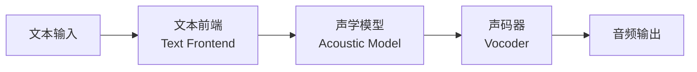

## 你每天听到的语音，背后藏着怎样的技术链条？

"今天天气怎么样？"——你对着手机说，几秒后一个悦耳的声音开始回答。这个看似简单的过程，背后是一套精密的三段式技术 pipeline。

TTS（Text-to-Speech，文本转语音）的核心任务是把书面文字变成可听语音。但"可听"只是起点，"好听"才是目标。从早期的机械拼读到如今的 AI 合成，TTS 技术经历了从信号处理到深度学习的范式迁移。

## 三段式 pipeline：TTS 是怎么工作的？

现代 TTS 系统采用三段式架构，每段各司其职：

**文本前端**是第一道关卡。它要处理文本规范化（把"$19.99"转成"十九点九九美元"）、分词、音素转换（G2P），还要预测韵律——哪里该停顿，哪里该重读。这一步的质量直接决定了合成语音的"可读性"。

**声学模型**是 TTS 的"大脑"。它把语言学特征映射成梅尔频谱（Mel-spectrogram）——一种频域表示，包含声音频率随时间变化的信息。从 Tacotron 的 Seq2Seq，到 FastSpeech 的非自回归，再到 VITS 的端到端 Flow Matching，声学模型的演进不断推高音质上限。

**声码器**是最后一道关卡。它把梅尔频谱还原成我们能听见的波形。这一步决定了合成语音的最终音质——是像机器人念稿，还是像真人在说话。

## 声码器的演进：从 Griffin-Lim 到 BigVGAN2

声码器的演进史，就是一部 TTS 音质的提升史。

| 年代 | 方法 | 代表模型 | 音质 | 速度 |
|------|------|---------|------|------|
| 2010s 前 | 信号处理 | Griffin-Lim | ★★ | ★★★ |
| 2016-2018 | 自回归 | WaveNet, WaveRNN | ★★★★ | ★ |
| 2018-2022 | GAN | HiFi-GAN, MelGAN | ★★★★ | ★★★★ |
| 2024+ | 流匹配 | BigVGAN2, iSTFTNet | ★★★★★ | ★★★ |

WaveNet 是第一个达到真人音质的声码器，但它的自回归特性导致推理极慢——生成 1 秒音频需要数分钟。HiFi-GAN 用 GAN 替代自回归，在保持音质的同时实现了实时推理（RTF < 0.1）。而 BigVGAN2 进一步在音质和速度之间找到了最佳平衡，成为当前工业界的主流选择。

流式场景对声码器提出了新要求。普通卷积会"看未来"（输出帧依赖未来输入），而流式声码器必须使用因果卷积——只看过去，不窥未来。HiFi-GAN Streaming、BigVGAN Streaming 就是为此而生。

## 中文 TTS：五大特殊挑战

如果说 TTS 是语音合成的"通用解"，那中文就是它的"终极考试"。

**声调**是第一道坎。中文是声调语言，同一个音节不同声调意思完全不同——"妈 mā"和"骂 mà"差之千里。模型不仅要生成正确的声音，还要生成正确的 F0（基频）曲线。更麻烦的是三声变调："你好"实际读 ní hǎo，不是 nǐ hǎo。

**多音字**是第二道坎。10% 的常用字是多音字，消歧严重依赖上下文。"银行"和"行走"的"行"读音完全不同。专有名词更是"读音黑洞"——"郫都"读 pí dū，不是 bì dū。

**分词**是第三道坎。英文天然有空格分词，中文没有。分错词就等于读错音："他已经走过来了"如果分成"他/已经/走/过来/了"，韵律全乱了。

**韵律**是第四道坎。中文的停顿不仅是"喘气"，还承担语法划分功能。"他说我/不好"和"他说/我不好"，停顿位置不同，意思完全相反。

**语料成本**是第五道坎。一套 20 小时的高质量中文 TTS 语料，成本约 50-100 万人民币，比英文贵 30-50%。

## 回头看：TTS 是一个系统工程

从文本前端到声学模型再到声码器，TTS 的每个环节都有其独特挑战。中文 TTS 更是要在声调、多音字、分词、韵律、语料五个维度上同时发力。

好消息是，当前开源模型（如 B 站的 IndexTTS）在中文场景下已经达到 MOS 4.01、WER 0.82% 的水平，低于真人的错误率。

展望未来，TTS 正在经历两场范式迁移：一是从 GAN 转向扩散/流匹配，音质上限更高；二是从专用模型转向 LLM 统一架构，TTS 不再是独立任务，而是大模型多模态能力的一部分。

下次当你对语音助手说"你好"时，不妨想想背后这段从文字到声波的奇妙旅程。
